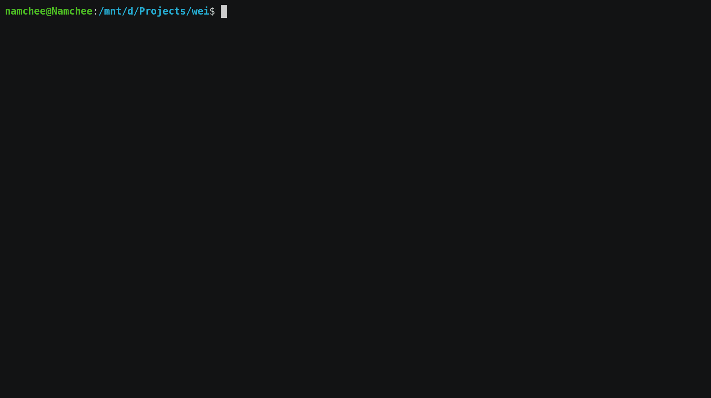

# Dependent

[](https://www.npmjs.com/package/@namchee/dependent) [](https://github.com/google/gts)  

> This project is still on active development. The API ***might** change without further notice.

Dependent is a simple utility CLI to find out which files in your NodeJS-based projects are using a certain dependency. 🚀



## Features

- 📦 Analyze dependency usage from all files in your project.
- 🚀 Blazing fast file parsing.
- 📁 Configurable path, analyze files that are actually relevant.
- ☑️ Failsafe parsing mode, no more failure caused by single file error.
- 📈 Expanding language support.

## Language Support

`dependent` is able to parse files with the following extensions:

1. Standard JavaScript files, `.js`
2. ESModules, `.mjs`
3. TypeScript files, `.ts`
4. React Extended JavaScript and TypeScript, `.jsx` and `.tsx`

More language support are incoming! Submit your language support ideas [here](https://github.com/Namchee/dependent/issues/new/choose)

Want to help `dependent` to be able to parse your favorite files? [Submit a pull request](https://github.com/Namchee/dependent/pulls)
## Installation

You can install `dependent` globally with your favorite package manager. Below is the example of installation with `npm`.

```bash
npm install -g @namchee/dependent
```

> This package can only be executed on NodeJS 12 or later.

## Usage

> Make sure that you have a working NodeJS installation! Refer to [this instruction](https://nodejs.org/en/download/) about how to setup NodeJS on your machine

`dependent` can be executed by your favorite terminal by executing `dependent` and supplying the name of the package that you want to analyze. For example:

```bash
# Which files that requires `express` in my project?
dependent express
```

By default, `dependent` will try to parse all supported files - except `node_modules` - in your project directory. To configure `dependent` to only scan specific files, `dependent` accepts an extra argument called `files` which is a list of [glob patterns](https://en.wikipedia.org/wiki/Glob_(programming)) that you want to analyze. For example

```bash
# Only analyze TypeScript files in the `src` directory
dependent express src/**/*.ts
```

After the command is given, `dependent` will produce a list of dependant files in your terminal. For example

```bash
✔ Analysis completed successfully

📦 There are 17 files in this project that depends on 'phaser'
 └── index.ts:1 → src/index.ts
 └── cherry.ts:1 → src/objects/cherry.ts
 └── flyer.ts:1 → src/objects/flyer.ts
 └── mushroom.ts:1 → src/objects/mushroom.ts
 └── player.ts:1 → src/objects/player.ts
 └── saw.ts:1 → src/objects/saw.ts
 └── spike.ts:1 → src/objects/spike.ts
 └── trophy.ts:1 → src/objects/trophy.ts
 └── game.ts:1 → src/scenes/game.ts
 └── pause.ts:1 → src/scenes/pause.ts
 └── preload.ts:1 → src/scenes/preload.ts
 └── result.ts:1 → src/scenes/result.ts
 └── splash.ts:1 → src/scenes/splash.ts
 └── title.ts:1 → src/scenes/title.ts
 └── assets.ts:1 → src/utils/assets.ts
 └── background.ts:1 → src/utils/background.ts
 └── ui.ts:1 → src/utils/ui.ts
```

Congratulation, you've used `dependent` successfully! 🎉

## CLI Reference

### Required Arguments

### `package`

`string`

Dependency name to be analyzed. Must be defined in `package.json` and installed in `node_modules`.

### Optional Arguments

### `files`

`string[]`

A list of glob patterns that specifies the directories to be analyzed. Space separated.

For example, the argument below will make `dependent` to analyze all JavaScript files that dependes on `express`
in `src` and `lib` directory.

```bash
dependent express src/**/*.js lib/**/*.js
```

### Flags

### `--help`, `-h`

Show the help menu

### `--silent`, `-s`

Suppress all parsing errors.

### `--table`, `-t`

Outputs the result in table-style format instead of line per line format.

## Motivation

It's Friday! Since tomorrow is free, you want to finish your work as soon as possible and enjoy your temporary holiday.After some refactoring, you realized package `x` is not used anymore in the files your refactored in your NodeJS based project. Realizing this, you proceed to execute `npm uninstall x` and then the uninstallation completed successfully.

Sadly, you don't realize that `x` is actually imported by another files that you didn't touch at all. Your project now breaks by your careless mistake 💥.

The above scenario is fine for small projects since they are easier to test and execute (and compile, if you're using a superset of JavaScript). But, what about big projects where it took so long to execute and compile? What about dynamic imports in not-fully-tested projects where the code may fail silently? What if there's a new team member who want to get onboard quickly but getting stuck on understanding why and where a dependency is needed?

This utility aims to fix those issues by automatically analyzing dependency usage in your projects and produce human-readable logs. Focus on your actual code, not on your dependency management. Let `dependent` analyze what dependency is actually needed and what isn't.

## License

This project is licensed under the [MIT License](./LICENSE).
